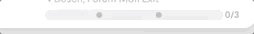

# Milestone Progress Bar

`import {MilestoneProgressBar} from 'milestone-progress-bar';`

An example of usage:

    <MilestoneProgressBar
    
    totalMilestones={3}
    
    progress={[
    
    {completed:  4,  total:  4},
    
    {completed:  2,  total:  2},
    
    {completed:  2,  total:  2},
    
    ]}
    
    />

Requires 2 props:
1) `totalMilestones` : `number` : Total number of milestones to complete the progress
2) `progress` : `list of objects` (object must have `completed` and `total`)  : `completed` must match `total` for a milestone to be marked complete. Do not increment value of `completed` of an object before marking the previous object fully complete.